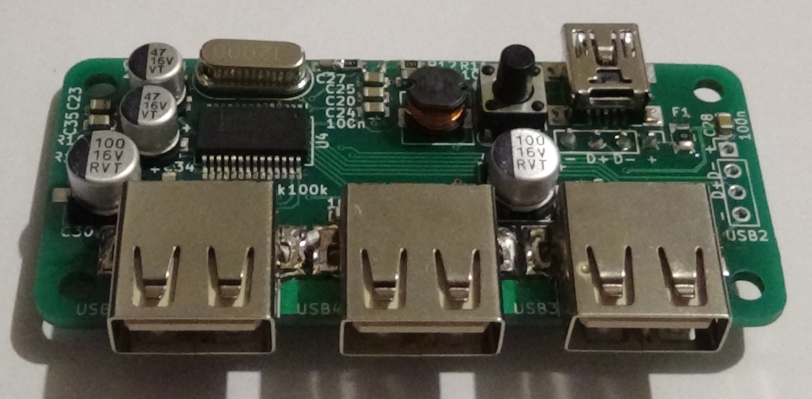
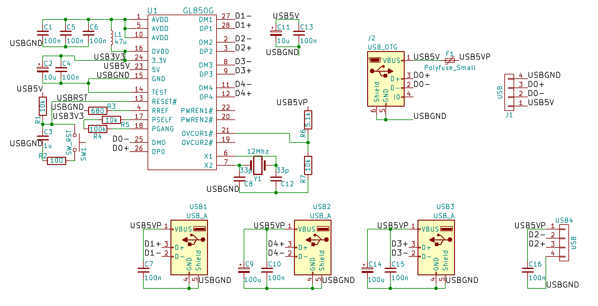

[:fr:](LISEZMOI.md) [:uk:](README.md)

# USB_Hub
GL852G or GL850G usb2.0 hub PiZero format
GL852G is Multi TT hub chip
GL850G is single TT hub chip

rev1
- R12 (new R3 in rev2) is connected to 5v, it must be connected to gnd

rev2
- Change R3 route
- Change the numbering of the components
